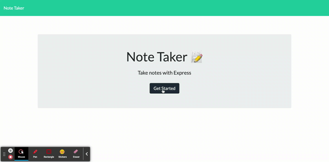

# Express.js--Note-Taker-App


[](https://spdx.org/licenses/MIT.html)
 ## Table of Contents
1. [Description](#description)

2. [Acceptance Criteria](#Acceptance-Criteria)

3. [Installation](#installation)

4. [Usage](#usage)

5. [Contributions](#contributions)

6. [Questions](#questions)


## Description

I have used the starter code provided to create an application that can bu used to create, save, and also delete notes, called Note Taker. I have used Express.js on the back end and all of the note data are saved and retrieved from a JSON file.

## Acceptance-Criteria

```
GIVEN a note-taking application
WHEN I open the Note Taker
THEN I am presented with a landing page with a link to a notes page
WHEN I click on the link to the notes page
THEN I am presented with a page with existing notes listed in the left-hand column, plus empty fields to enter a new note title and the note’s text in the right-hand column
WHEN I enter a new note title and the note’s text
THEN a Save icon appears in the navigation at the top of the page
WHEN I click on the Save icon
THEN the new note I have entered is saved and appears in the left-hand column with the other existing notes
WHEN I click on an existing note in the list in the left-hand column
THEN that note appears in the right-hand column
WHEN I click on the Write icon in the navigation at the top of the page
THEN I am presented with empty fields to enter a new note title and the note’s text in the right-hand column
```

Directory Structure:


## Installation

Make sure to have node.js installed before running application.
if not please go here https://nodejs.org/en/download/package-manager/

Once Node.js is installed please enter the following:
```
npm install

npm init

npm i inquirer

npm i express

```

## Usage

The application will be invoked by using the following command:

```bash
node index.js
```
The test using jest can be invoked by using the following command:

```bash
npm run test
```


### Click link to open in your browser.


Walkthrough video: 

https://drive.google.com/file/d/1k33GzGwC8c0IbeFsfwOrxxGIyRg_PXfV/view?usp=sharing

 
Screen Shot of Note Taking Application:





[Deployed Heroku site] https://safe-caverns-44839.herokuapp.com/

[github repository site] https://github.com/Jbarbss/Express.js--Note-Taker-App


 
## Contributions
---

Ben Durham (https://github.com/bdurham227)
<br>
Takuya Matsumoto (https://github.com/TakuyaMats)
<br>
Patrick Walker (https://github.com/pat31477)
<br>

## Questions
 ---
 If you have any questions about this application please reach out 
 using the contact information below:

Github: https://github.com/jbarbss

Email: Jbarbanel@gmail.com


## License
 
[](https://spdx.org/licenses/MIT.html)

   https://opensource.org/licenses/MIT

Licensed under the MIT License

Copyright © [2021] [Jason Barbanel]
    
 Permission is hereby granted, free of charge, to any person obtaining a copy of this software and associated documentation files (the "Software"), to deal in the Software without restriction, including without limitation the rights to use, copy, modify, merge, publish, distribute, sublicense, and/or sell copies of the Software, and to permit persons to whom the Software is furnished to do so, subject to the following conditions:
        
The above copyright notice and this permission notice shall be included in all copies or substantial portions of the Software.
        
THE SOFTWARE IS PROVIDED "AS IS", WITHOUT WARRANTY OF ANY KIND, EXPRESS OR IMPLIED, INCLUDING BUT NOT LIMITED TO THE WARRANTIES OF MERCHANTABILITY, FITNESS FOR A PARTICULAR PURPOSE AND NONINFRINGEMENT. IN NO EVENT SHALL THE AUTHORS OR COPYRIGHT HOLDERS BE LIABLE FOR ANY CLAIM, DAMAGES OR OTHER LIABILITY, WHETHER IN AN ACTION OF CONTRACT, TORT OR OTHERWISE, ARISING FROM, OUT OF OR IN CONNECTION WITH THE SOFTWARE OR THE USE OR OTHER DEALINGS IN THE SOFTWARE


